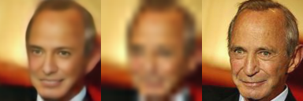
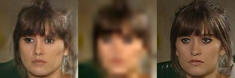
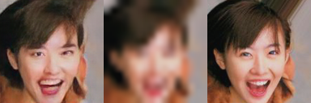

# Deep Feature-preserving Based Face Hallucination: Feature Discrimination Versus Pixels Approximation

This is a tensorflow implementation of [Deep Feature-preserving Based Face Hallucination: Feature Discrimination Versus Pixels Approximation]().

# File Description
* config.py : include configuration for file paths and hyperparameters for networks.
* train_generator.py : code to train our generator with MSE loss.
* train_gan.py : code to train our generator and discriminator with MSE loss, perceptual loss and adversarial loss.
* train_gan_encoder.py : code to train our generator, discriminator and encoder with MSE loss, adversarial loss and encoder loss.
* train_full.py : code to train our full network with MSE loss, adversarial loss and feature adversarial loss.
* test.py : code to inference our generator with a trained model.

# Setup
## requires
+ python 3.5
+ tensorflow 1.8.0
+ tensorlayer
+ numpy
+ scipy
+ skimage

## run
- Clone this repo:
    ```
    > git clone git@github.com:hengliusky/Feature-preserving-Based-Face-Hallucination.git
    > cd Feature-preserving-Based-Face-Hallucination-tensorflow
    ```
- Download the [CelebA](http://mmlab.ie.cuhk.edu.hk/projects/CelebA.html) dataset. Move the first 18K faces to `/data/train`, the next 2k faces to `/data/test`
- Train or test the model.
    ```
    > python train_generator.py
    ```

# Resluts
Here is the results generated by this implementation:
## Our-generator

## Our-GAN

## Our-GAN-Encoder

## Our-full


# Acknowledge
Our code architecture is based on [tensorlayer-srgan](https://github.com/tensorlayer/srgan). Thanks for their excellent work!